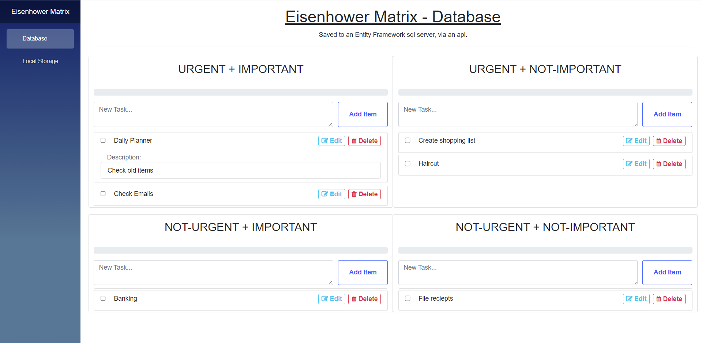
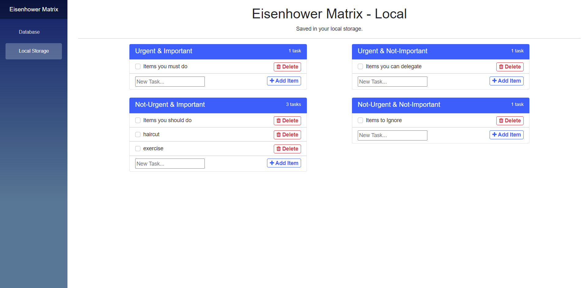

# Eisenhower Matrix
Blazor-Server app with different Eisenhower Matrix's:
1. One stores the data in an Entity Framework SQL database via and API. 
2. The second stores the data in your local storage. 

## #1 Database (API & EF Core)
Eisenhower prioritisation matrix. 
* The server setup and management using Entity Framework Core.
* Server access through a CRUD API.

     

## #2 Local Storage
Eisenhower prioritisation matrix. 
* Lists are stored and retrieved from your local storage.

     

